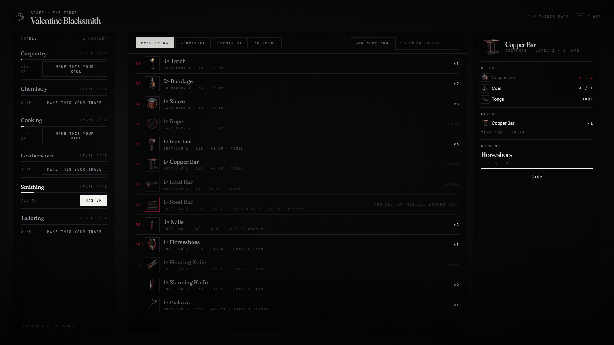

# lxr-craft — Making things, for LXRCore

Recipes take catalog items and give catalog items at a station — the
forge, the tanning rack, the kitchen, the workbench, the reloading bench,
a campfire — or in the hands, for the simple things. Every craft earns
experience in a trade; trades have levels; some recipes need a level, some
need the trade to be your mastery. The server keeps the clock, the books
and the ledger of who made what.



## What it does

* **Recipes** — `Config.Recipes`: kind, trade, level, XP, seconds, inputs, outputs, an optional tool that is kept, `special` for mastery-only. 36 shipped across six trades, every one priced so the outputs are worth at least the inputs on the ledger (the tests check).
* **Stations** — `Config.Stations` points through lxr-interact; `/craft` opens the by-hand book anywhere.
* **The book** — filter by what you can make now, search, each recipe with have/need per ingredient, the tool, time, level, XP; make 1–N in a queue the server times (inputs taken per unit; walking away or running short stops it).
* **Trades** — levels from an XP curve (`Config.Levels`), progress bars, level-up notices; **mastery** (`Config.Specialisation`): choose `slots` trades, change for a price.
* **Events** — `lxr:craft:made (src, recipe, trade, xp)`; exports `Level`, `AddXP`, `Specials` for other resources (a hunter's skinning, a farmer's harvest) to feed the trades.
* **Not verified in game** — station scenario names in `Config.Kinds`; a bad name plays nothing.

## Install

```cfg
ensure lxr-core
ensure lxr-inventory
ensure lxr-interact
ensure lxr-craft
```

The table `lxr_craft_books` is created by the core migration runner.

## Building the interface

Vite + React + TypeScript: source in `ui/`, built output in `html/` (`cd ui && npm install && npm run build`). `style.css` uses kit tokens only; `tools/kit_check.py` guards it.

## Licence

© 2026 iBoss21 / LXRCore — All Rights Reserved. See `LICENSE`.
